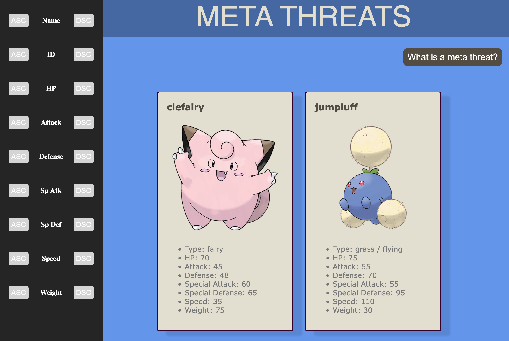
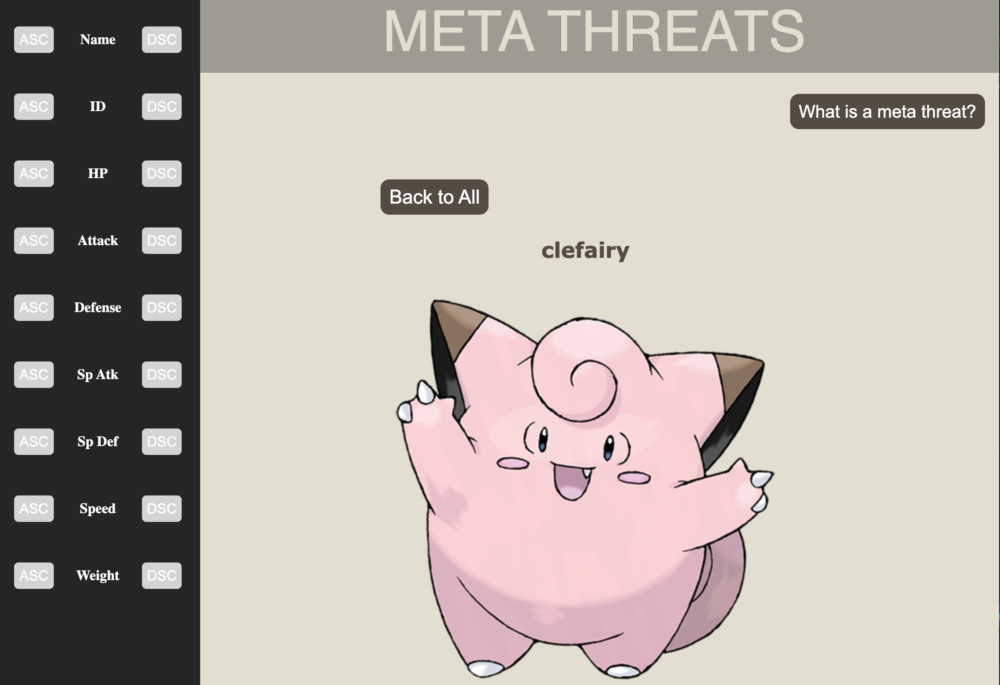
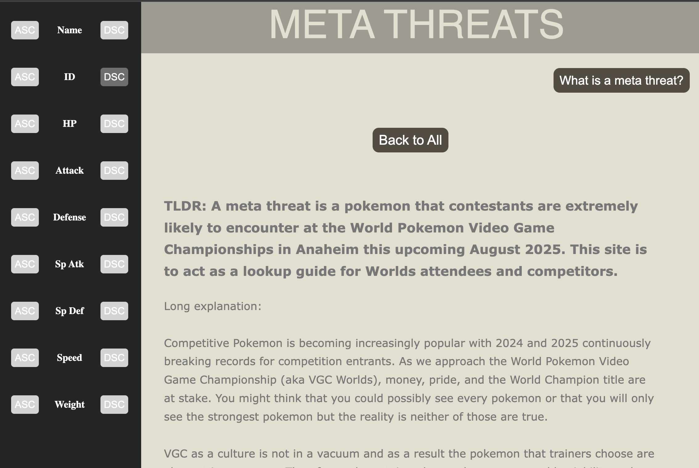
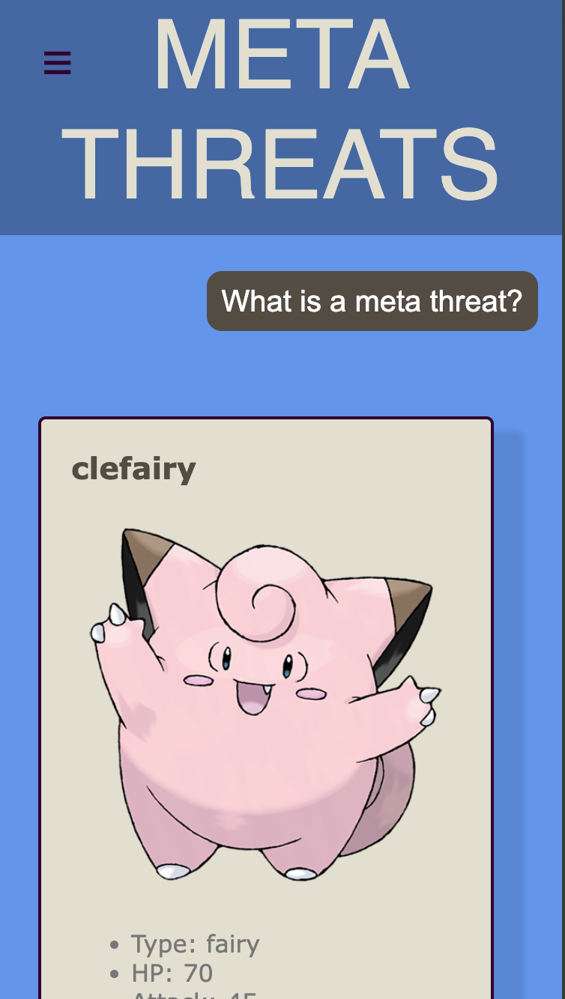
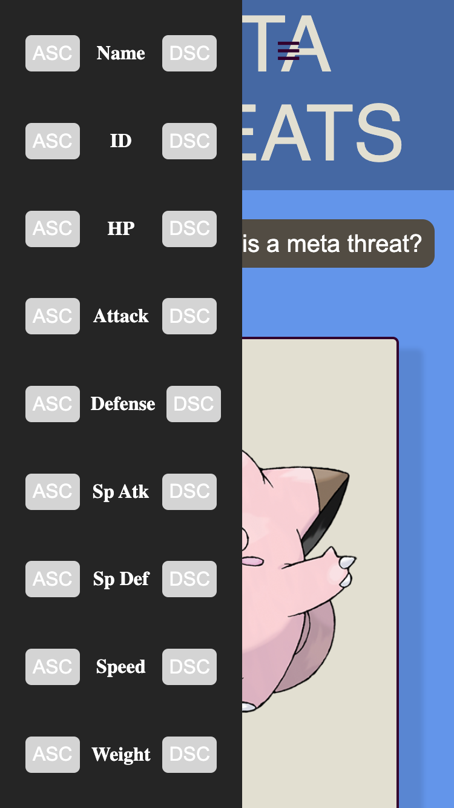
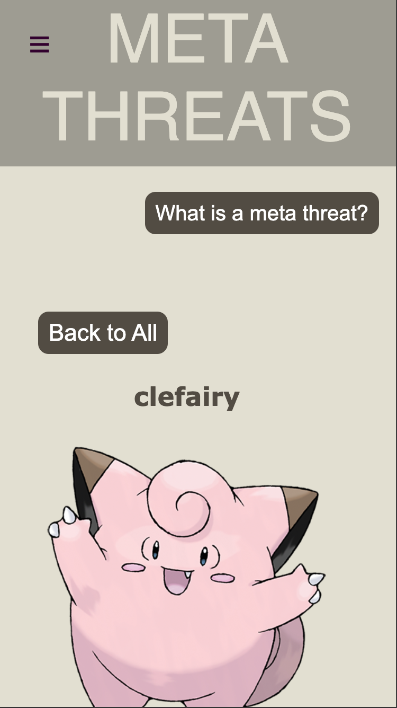

# My catalog project: the meta threats at worlds

This code base forms a simple webpage that allows users to filter the Pokemon they are most likely to see at the Pokemon World Championships via their various stats and learn about their details.

---

## Features

   - Sort all meta pokemon via their stats
   - Detail view of every mon 
   - Type effectiveness extrapolated from data
   - Responsive design for mobile and desktop

---

## Link to site

https://1jdsteele.github.io/steele_snapCatalog/

---

## The general gist

This project was made for a snapchat interview in which I was supposed to create a catalog featuring data that can be manipulated. The data comes from PokeAPI and I copied and pasted the JSON from there to a local file which is read and parsed byt the program. I manipulate the data in two major ways by allowing the user to sort, and by extrapolating information from it to give to the user in a digestible format.

---

## How to use this program

Since I marked scripts.js (the main js page) as type=module, I had to run this via a live server which I had to get an extension from in vscode. If you fork it, you may have to have this extension as well to run locally.

If viewing this project via GitHub pages, all you will need is a modern browser and internet access.

I tried to make the program intuitive by modern standards. It is responsive to window size changes. When viewed in mobile (or slimmer widths) The side menu disappears and is summoned by a hamburger menu. The side menu has most functionality for the users, allowing them to organize the pokemon via any of their stats. The user can also click on an individual pokemon to see more details about them.

---

## Site appearance

### Desktop front page

### Desktop details page

### Desktop explanation page

### Mobile front page

### Mobile front page with menu

### Mobile details page

### Mobile explanation page

---

## Technologies used

I use classic webdev by using vanilla javascript, css, and html. I used the assistance of AI for help with the CSS and HTML, and I used various resources (read: stackoverflow) as well as past notes to help me create the javascript.

---